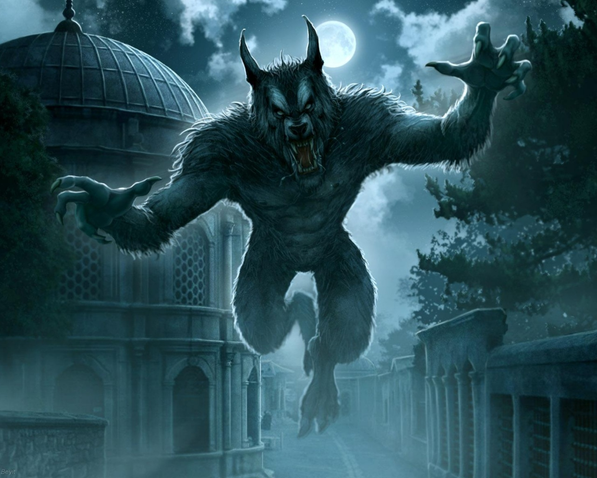

IRC based online Werewolf (a [Mafia][3] theme) game

***
**THIS PROJECT IS UNDER HARDLY DEVELOPMENT**
***

## Installation

Simply install using NPM.

```bash
npm install -g ayazaga
```

## Configuration

You should create the IRC settings file at `config/irc.yml`

```yaml
channel: "#wolfgamechannel"
auth:
  username: yourusername
  password: password

connection:
  host: irc.freenode.net
  port: 6667

owners: [user1, user2]
admins: [user1, user2]
```

## Run

Then, you can connect to server and start the game:

```bash
ayz start
```

You can change connection file:

```bash
ayz start --config=config/another-config.yml
```

## Game and Name

Inspired from [lykoss/lykos][1], a Werewolf party game based on IRC Protocol,

From Wikipedia:
> **Mafia** (Russian: Ма́фия, also known as **Werewolf**) is a party game created
> in the USSR by Dimitry Davidoff in 1986,[3] modelling a conflict between
> an informed minority (the mafia) and an uninformed majority (the innocents).
> At the start of the game each player is secretly assigned a role affiliated
> with one of these teams. The game has two alternating phases: "night",
> during which the mafia may covertly "murder" an innocent, and "day", in
> which surviving players debate the identities of the mafiosi and vote to
> eliminate a suspect. Play continues until all of the mafia has been
> eliminated, or until the mafia outnumbers the innocents.

[Ayazağa][2] is a village in Istanbul, Turkey which is famous for wolves and
killer software projects.

## License
MIT

<!--

*Found this image from Google Search*
-->

[1]: http://github.com/lykoss/lykos
[2]: http://tr.wikipedia.org/wiki/Ayaza%C4%9Fa,_Sar%C4%B1yer
[3]: http://en.wikipedia.org/wiki/Mafia_(party_game)
